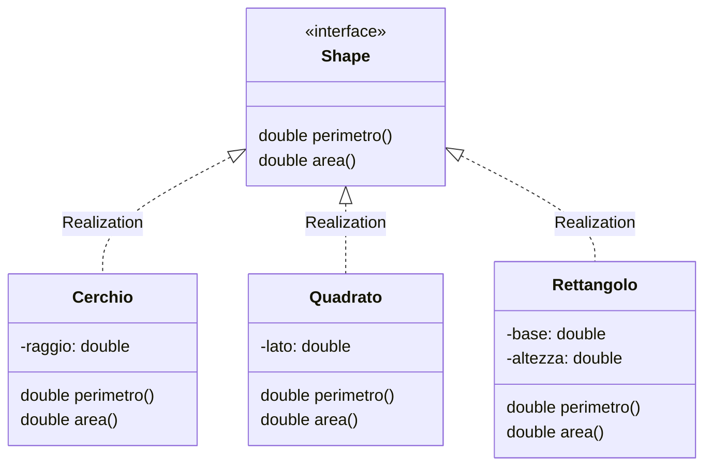
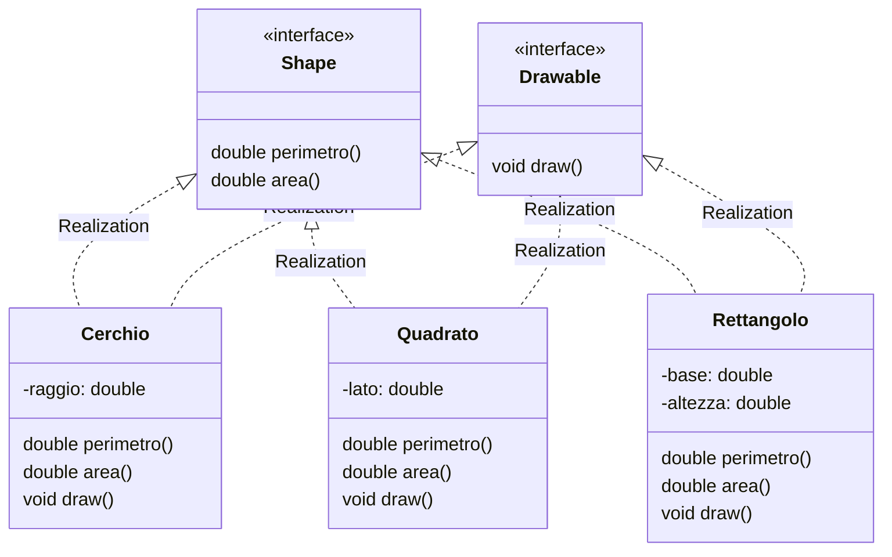

# Try Interface

```mermaid

classDiagram
class Shape
<<interface>> Shape
Shape : double perimetro()
Shape : double area()

Shape <|.. Cerchio : Realization
Cerchio: double perimetro()
Cerchio: double area()

class Cerchio {
    -raggio: double
  }

Shape <|.. Quadrato : Realization
Quadrato: double perimetro()
Quadrato: double area()

class Quadrato {
    -lato: double
}

Shape <|.. Rettangolo : Realization
Rettangolo: double perimetro()
Rettangolo: double area()

class Rettangolo {
    -base: double
    -altezza: double
}

```

## Implementazione di più interfacce

```mermaid

classDiagram
class Shape
<<interface>> Shape
Shape : double perimetro()
Shape : double area()

Shape <|.. Cerchio : Realization
Cerchio: double perimetro()
Cerchio: double area()

class Cerchio {
    -raggio: double
  }

Shape <|.. Quadrato : Realization
Quadrato: double perimetro()
Quadrato: double area()

class Quadrato {
    -lato: double
}

Shape <|.. Rettangolo : Realization
Rettangolo: double perimetro()
Rettangolo: double area()

class Rettangolo {
    -base: double
    -altezza: double
}

class Drawable
<<interface>> Drawable
Drawable : void draw()

Drawable <|.. Quadrato : Realization
Drawable <|.. Cerchio : Realization
Drawable <|.. Rettangolo: Realization

Cerchio: void draw()
Quadrato: void draw()
Rettangolo: void draw()

```

Vedi: https://iisponti.gitbook.io/tecnologie_quinta_2023_24/esempio-interface